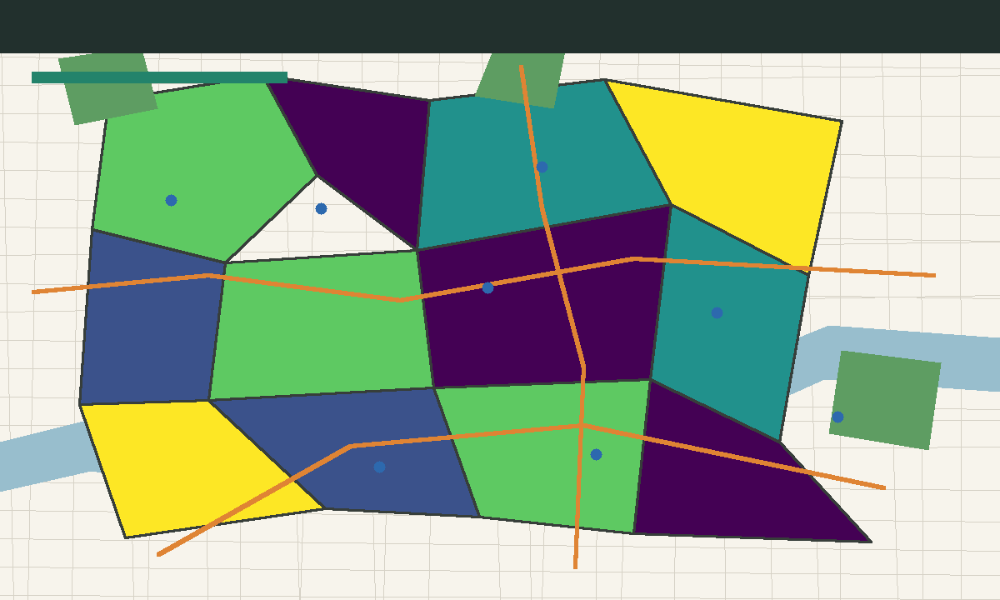
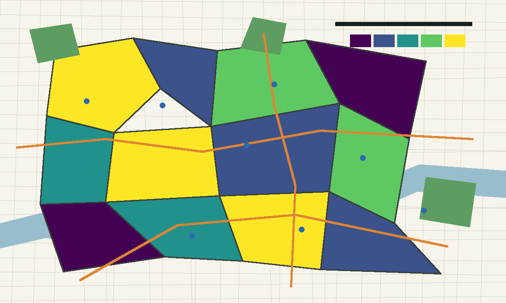
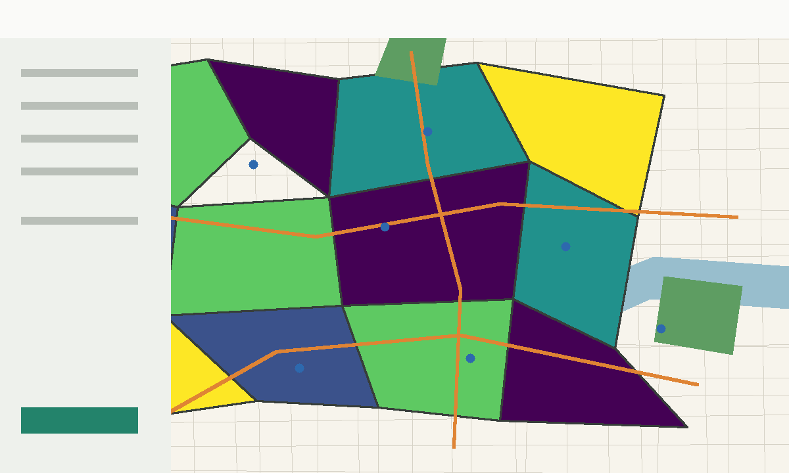

# A2GeoLens


Walkability & amenity access analysis for Ann Arbor census tracts using OSM data and QGIS.

A2GeoLens pulls open geospatial data for Ann Arbor, scores each census tract on access to parks, transit, grocery stores, and bike infrastructure, then visualizes the results as both a QGIS-ready GeoJSON output and an interactive Leaflet web map. The project surfaces equity gaps in urban infrastructure by showing which neighborhoods have strong walkable access and which remain more car-dependent.

## Live Map

Local preview:

```bash
cd docs
python -m http.server 8000
```

Then open <http://localhost:8000>. The map must be served over HTTP; opening `docs/index.html` directly with `file://` can block GeoJSON loading in the browser.

This repo is currently private, so GitHub Pages availability depends on the account and repository settings. If private Pages is enabled, publish from the `docs/` folder.

Optional Felt link: _add public Felt map link here after publishing_.

## Methodology

OpenStreetMap features are downloaded with OSMnx for the Ann Arbor, Michigan, USA boundary. The pipeline extracts parks, bike infrastructure, transit stops, schools, and grocery stores, saving each layer as GeoJSON for inspection and QGIS use. Census tract geometry is fetched with pygris from 2020 Census TIGER/Line cartographic boundary data for Washtenaw County, then filtered to tracts whose centroid falls inside Ann Arbor or whose city overlap is at least 25%.

Storage and web outputs use EPSG:4326 for compatibility with GeoJSON, Leaflet, Felt, and QGIS defaults. Distance and length calculations use EPSG:3078, a Michigan meter-based projected CRS, to avoid unit mistakes from foot-based state plane projections.

The score combines four normalized components: parks intersecting an 800-meter tract buffer, transit stops within each tract, clipped bike-lane length in meters, and distance from tract centroid to the nearest grocery store. Grocery distance is inverted so closer access scores higher. The final `walkability_score` is the unweighted mean of the normalized components, scaled from 0 to 100.

Limitations: OSM completeness varies by neighborhood and feature type, the score is intentionally unweighted, tract-level aggregation hides block-level variation, and an 800-meter buffer is a simple walk-access proxy rather than a routed sidewalk-network measure.

## Tech Stack

QGIS 3.x, Python, GeoPandas, OSMnx, Shapely, pygris, Leaflet, Felt, GeoJSON, GitHub Pages.

## Setup

```bash
git clone https://github.com/vittorio-centore/A2GeoLens.git
cd A2GeoLens
python3 -m venv .venv
source .venv/bin/activate
pip install -r requirements.txt
```

If the geospatial Python stack fails to install with pip on your machine, use conda or mamba for GeoPandas, PyProj, Shapely, and Pyogrio, then install the remaining requirements.

Fetch OSM data:

```bash
python scripts/fetch_osm.py
```

Compute tract scores:

```bash
python scripts/compute_access.py
```

Preview the interactive map:

```bash
cd docs
python -m http.server 8000
```

Open the QGIS project after generating data:

```text
qgis/a2geolens.qgz
```

If the QGIS project file has not been authored yet, create a new QGIS project, load the GeoJSON layers from `data/raw/` and `data/processed/`, style `walkability_score` with graduated symbology, save layer styles to `qgis/styles/`, and save the project as `qgis/a2geolens.qgz`.

## QGIS And Felt Finishing Steps

In QGIS, set the project CRS to EPSG:4326, add an OpenStreetMap XYZ basemap, load the raw and scored GeoJSON layers, and style `tracts_scored.geojson` with five natural-break classes using a viridis ramp. Style parks in green, bike lanes as orange lines, and transit stops as small blue circles. Export the final layout screenshots into `docs/screenshots/`.

In Felt, upload `data/processed/tracts_scored.geojson`, style by `walkability_score`, add supporting layers for parks, bike lanes, and transit stops, then paste the shared link into the Live Map section.

## Skills Demonstrated

- QGIS project authoring
- Graduated symbology
- Spatial joins
- Buffer analysis
- CRS reprojection
- OSM data ingestion
- Census tract filtering
- Choropleth web mapping
- Accessibility scoring methodology

## Screenshots







## Data Sources & Licenses

OpenStreetMap data is available under the Open Database License (ODbL). Census TIGER/Line geography is public domain from the U.S. Census Bureau.

